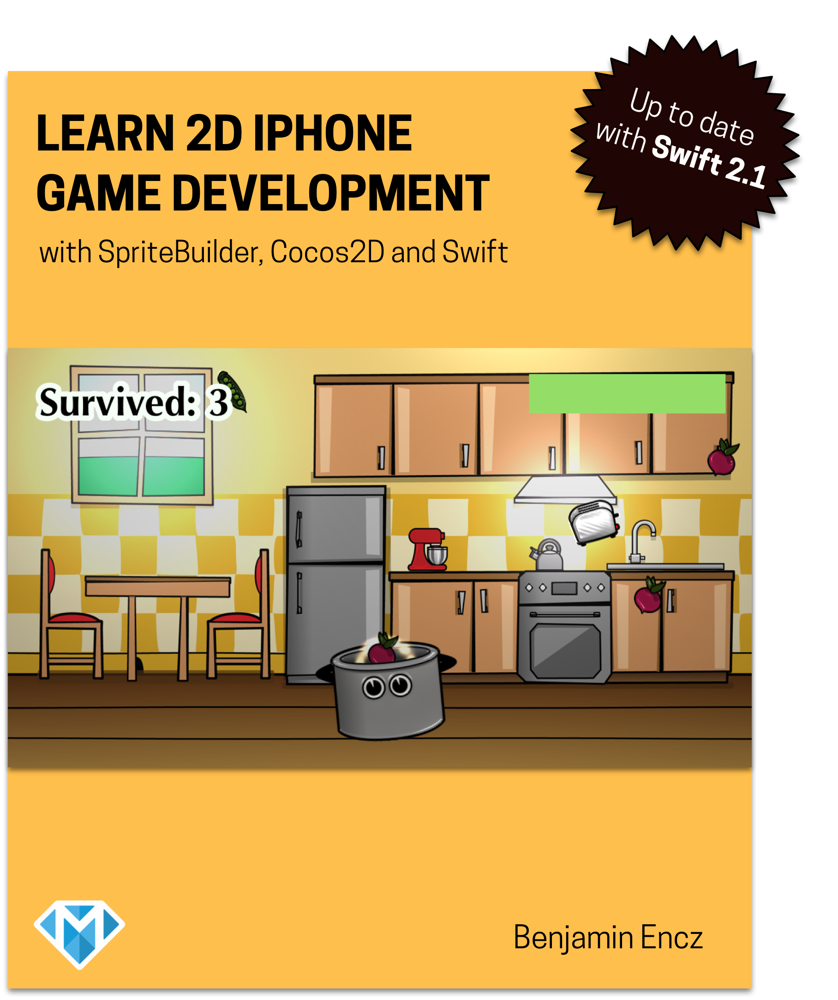

#Source Code Repository for the SpriteBuilder Book

**Note: This is the code for the updated version of the book, it's compatible with Swift 2.1.** If you're looking for an older version of the solutions you can find them on the [Swift 1.2 branch](https://github.com/SpriteBuilder-Book/Code/tree/swift-1.2).

This is the source code repository for the book [Learn 2D iPhone Game Development](http://www.spritebuilder-book.com).

